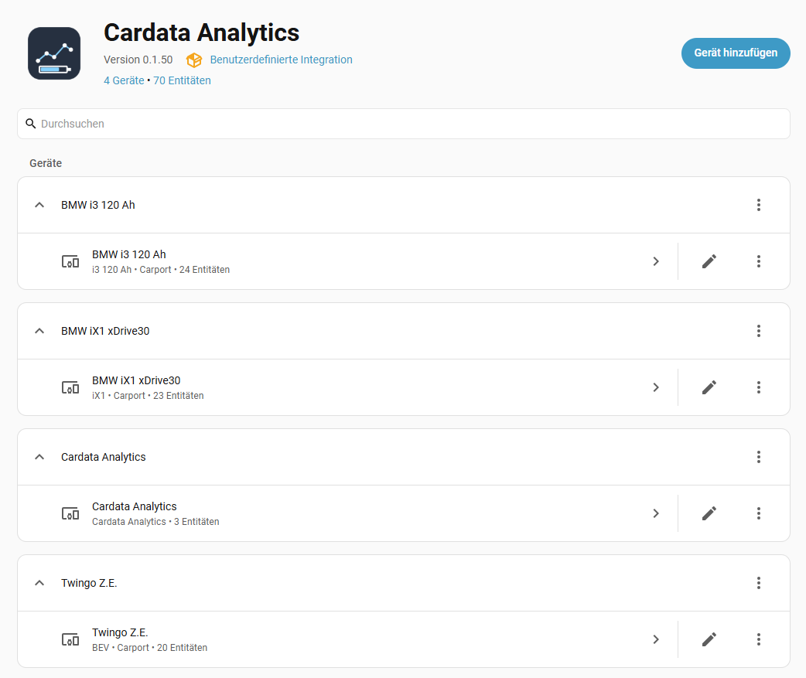
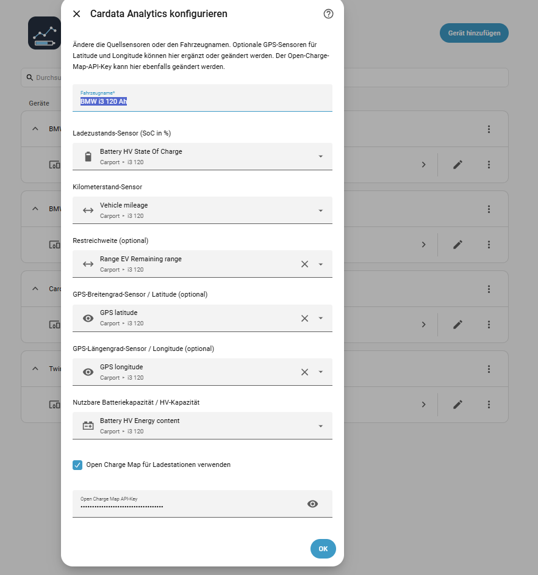
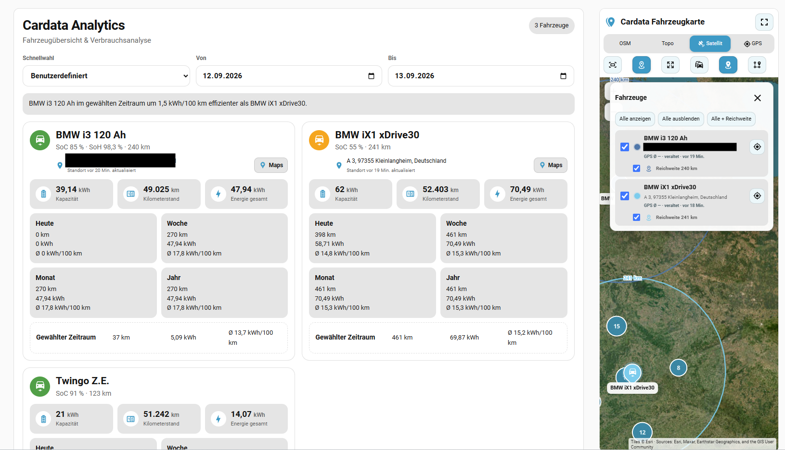
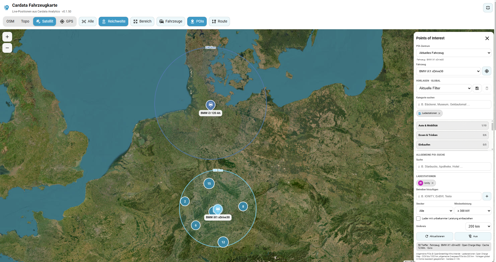
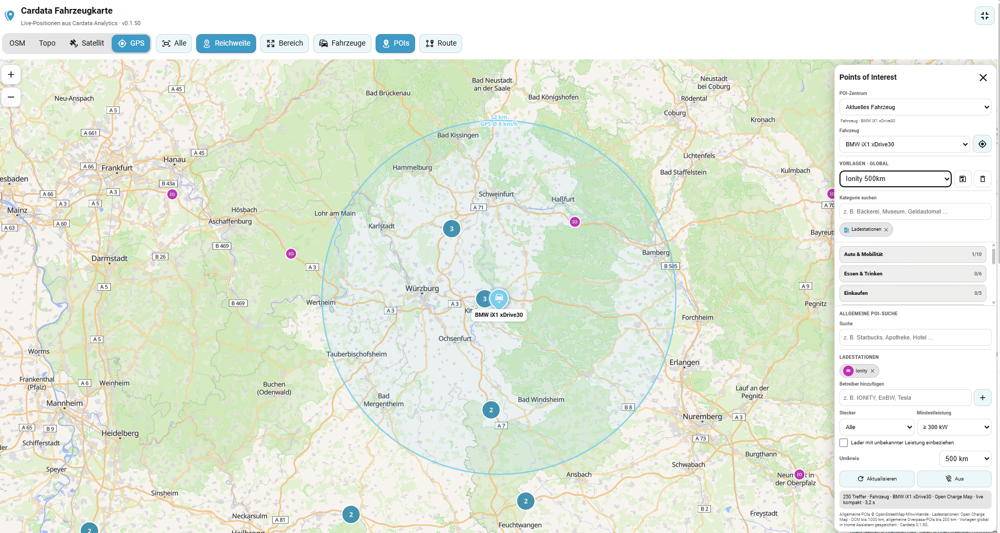
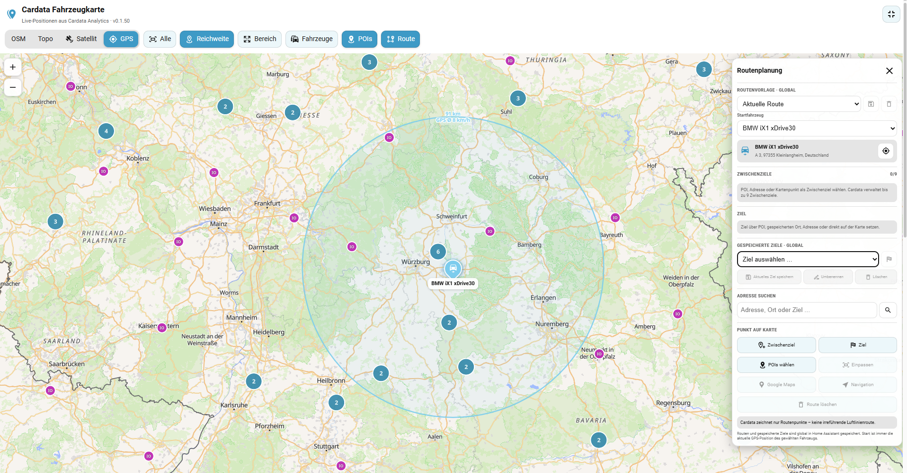

# Cardata Analytics

Cardata Analytics is a Home Assistant custom integration for analysing battery-electric vehicle data that already exists as Home Assistant sensor entities.

It adds vehicle analytics, persistent comparison periods, an automatic multi-vehicle analytics card, and a MapLibre-based vehicle map with remaining-range overlays, POIs, charging-station search and route planning.

The integration does **not** connect directly to a vehicle manufacturer. It works with data supplied by another Home Assistant integration, MQTT, REST, CAN/OBD or any other source that exposes suitable sensor entities.

> **Current release:** v0.1.56  
> **Home Assistant:** 2026.1.0 or newer  
> **Languages:** German and English. The Home Assistant language is detected automatically; other languages currently fall back to English.

> **Screenshots and mobile support:** The screenshots in this README were captured in the **desktop view**. Both custom cards are responsive and are designed to remain fully usable on smartphones and tablets, including **iPhone/iOS**. Narrow layouts reflow the map controls, POI panels become vertically scrollable, route point picking uses a compact mobile mode, and fullscreen respects iPhone safe areas. The screenshots were captured from the v0.1.50 UI. The overall layout remains representative of v0.1.56; later releases add fixes and refinements without changing the basic card structure shown here.

---

## Highlights

- Multiple battery-electric vehicles in one integration
- Manufacturer-neutral **BEV** setup plus convenience presets for **BMW i3 120 Ah** and **BMW iX1**
- SoC, odometer, usable battery capacity, remaining range and optional SoH/GPS integration
- Estimated energy consumption and average consumption in kWh/100 km
- Today / week / month / year analytics
- Persistent custom comparison periods with a compact daily ledger
- Home Assistant long-term statistics support
- Responsive automatic analytics card for all configured vehicles
- Interactive **MapLibre** vehicle map
- OpenFreeMap Liberty, detailed OpenStreetMap Standard (`OSM+`), OpenTopoMap and Esri satellite layers
- Multiple vehicles with deterministic colours and coloured markers
- Live remaining-range rings per vehicle
- Continuous GPS follow while keeping the selected zoom level
- Frontend-only GPS movement information including average speed between valid GPS updates and direction
- **57 POI categories** with clustering and local free-text filtering
- **Open Charge Map** charging stations with operator, connector and power filters
- Multiple charging operators selectable at the same time
- POI search radius up to **1000 km for charging stations**
- Global POI templates shared across devices
- Route planning with live vehicle position as origin
- Up to **9 internal intermediate stops**
- POIs, address-search results and free map points can be used as intermediate stops or destinations
- Global route templates and named destinations
- Home Assistant `zone.*` entities as route targets
- Google Maps / Navigation handoff
- Responsive desktop, tablet and mobile UI including iPhone safe-area handling

---

## How Cardata Analytics works

Cardata Analytics reads the source entities you select during setup and creates its own calculated Home Assistant entities. Vehicle analytics are calculated locally inside Home Assistant.

For consumption estimation, falling SoC is converted into consumed energy using the configured usable battery capacity:

```text
consumed_kWh = (old_SoC - new_SoC) / 100 × usable_battery_capacity_kWh
```

SoC increases are treated as charging and are not counted as driving consumption.

Average consumption is calculated from estimated consumed energy and driven distance:

```text
kWh_per_100km = consumed_kWh / driven_km × 100
```

The quality of these values depends on the precision and update frequency of the source sensors. Cardata Analytics does not invent missing vehicle data.

---

## Requirements

Cardata Analytics requires existing Home Assistant entities for the vehicle data.

### Required for every vehicle

| Source | Expected value |
|---|---|
| State of charge | Percentage from 0 to 100 |
| Odometer / mileage | Distance sensor |
| Usable battery capacity | Capacity sensor or a fixed kWh value for generic BEVs |

### Optional

| Source | Purpose |
|---|---|
| Remaining range | Range display, analytics-card information and map range ring |
| State of health | Exposed as a Cardata SoH entity where supported |
| GPS latitude | Vehicle position and map features |
| GPS longitude | Vehicle position and map features |

Latitude and longitude must always be configured together.

Distance source units are normalized from `km`, `mi` or `m` to kilometres. Capacity values are normalized from `kWh`, `Wh` or `MWh` to kWh.

---

# Installation

## HACS installation

Cardata Analytics can be installed as a custom HACS integration.

1. Open **HACS** in Home Assistant.
2. Open the menu in HACS and select **Custom repositories**.
3. Add the repository:

   ```text
   https://github.com/lemuba/cardata-analytics
   ```

4. Select **Integration** as the repository type.
5. Search for **Cardata Analytics** in HACS and install it.
6. Restart Home Assistant.
7. Go to **Settings → Devices & services**.
8. Select **Add integration**.
9. Search for **Cardata Analytics**.

## Manual installation

Copy the complete integration directory:

```text
custom_components/cardata_analytics
```

into:

```text
/config/custom_components/cardata_analytics
```

Restart Home Assistant and add **Cardata Analytics** through **Settings → Devices & services → Add integration**.

---

# Integration setup

## 1. Choose a vehicle type

The setup flow offers three vehicle types:

### BEV

The manufacturer-neutral option and the recommended choice for most electric vehicles.

You can either select a sensor that represents the vehicle's **total usable battery capacity** or enter a fixed usable capacity in kWh.

If both are configured, the fixed value can also serve as a fallback when the live capacity source is unavailable.

### BMW i3 120 Ah

Convenience preset with a required usable HV-capacity sensor and built-in SoH estimation based on the configured usable battery capacity.

### BMW iX1

Convenience preset with a required usable HV-capacity sensor and optional source SoH sensor.

> The capacity source must represent the battery's **total usable capacity**, not the energy currently stored in the battery.

## 2. Select the source entities

For each vehicle configure:

- vehicle name
- SoC sensor
- odometer sensor
- usable battery-capacity sensor or fixed capacity where applicable
- optional remaining-range sensor
- optional SoH sensor where applicable
- optional GPS latitude and longitude sensors
- Open Charge Map usage and API key

You can add any number of vehicles by running **Add integration → Cardata Analytics** again.

## 3. Reconfigure an existing vehicle

Open the Cardata Analytics integration entry in **Settings → Devices & services** and use **Reconfigure** to change source entities, vehicle name, GPS sources or the Open Charge Map setting/API key.

Existing Cardata entity identities remain stable when source entities are reconfigured.

### Integration and vehicle setup screenshots

| Integration overview | Vehicle setup / reconfigure |
|---|---|
|  |  |

---

# Open Charge Map for charging stations

Cardata Analytics deliberately uses **Open Charge Map (OCM)** for charging-station POIs instead of treating charging stations as just another general OpenStreetMap/Overpass category.

Open Charge Map is a community-driven, non-commercial charging-location project with a dedicated API and structured EV-charging data. Its API can provide information that is especially useful for an EV map, including operator/network, connection types, charging power, status, address and capacity where available.

This separation has several advantages for Cardata Analytics:

- charging-station searches are independent from public Overpass availability
- large charging searches can use radii of **500 km or 1000 km** without sending an equivalent general-purpose Overpass query
- operator/network filters can be combined, for example **IONITY + EnBW + Tesla**
- connector and minimum-power filters can be applied to normalized charging data
- operator colours and two-character labels can be shown consistently on the map
- charging results can be cached independently from normal OSM POIs

General POIs such as restaurants, parking, hotels, pharmacies or service stations continue to use OpenStreetMap data through public Overpass instances. Their radius is protected at a maximum of **200 km**.

## Open Charge Map API key

A **free Open Charge Map API key** is required when OCM charging-station support is enabled.

1. Create or sign in to an account at [openchargemap.io](https://openchargemap.io/).
2. Open your profile and go to **My Apps**.
3. Register an application and obtain your API key.
4. Enter the key in the Cardata Analytics setup or **Reconfigure** flow.

Useful Open Charge Map links:

- [Open Charge Map developer information](https://openchargemap.io/develop)
- [Open Charge Map API documentation](https://openchargemap.io/develop/api)
- [Open Charge Map registration](https://openchargemap.io/loginprovider/register)

The key is stored in the **Home Assistant backend** and is not entered into the Lovelace card. Cardata Analytics validates the key during setup and keeps the same OCM configuration synchronized across its integration entries.

Open Charge Map is an external community service. Charging-location data can originate from different providers and community contributions, so completeness and accuracy cannot be guaranteed. Cardata Analytics displays provider attribution where available.

---

# Home Assistant entities and analytics

Each configured vehicle receives Cardata Analytics entities for the available/calculated data, including:

- state of charge
- odometer
- usable battery capacity
- total estimated consumed energy
- distance and estimated consumed energy for today
- average consumption for today
- distance, energy and average consumption for week, month and year
- selected-period distance, energy and average consumption
- remaining range when configured
- SoH when available/supported
- GPS latitude and longitude when configured
- current address when GPS is configured

## Comparison periods

Cardata Analytics creates one integration-wide comparison-period control shared by all configured vehicles.

Available presets are displayed as:

- Custom
- Today
- Last day
- Last 7 days
- Last month
- Last year

A custom from/to date range can also be selected. The end date is inclusive.

### Persistent daily ledger

For reliable historical ranges, Cardata Analytics maintains a compact local daily ledger per vehicle. Completed days store the driven distance and estimated consumed energy required for selected-range calculations, while the current day continues to use live values.

The ledger is designed to stay small and persistent even over long periods.

If Home Assistant was offline around a day boundary and the exact result cannot be reconstructed safely, Cardata Analytics marks the day incomplete instead of silently guessing values. A conservative recovery mechanism can reconstruct a single unambiguous missing day when aggregate counters provide enough information.

### Temporary source outages

If a configured odometer source temporarily becomes unavailable, Cardata Analytics keeps the last valid odometer reading instead of making the analytics disappear. It does not estimate missing driving distance; the value catches up when the upstream source becomes valid again.

---

# Dashboard cards

Cardata Analytics ships both dashboard cards inside the integration. No separate frontend repository is required.

When Home Assistant uses Lovelace **storage mode**, Cardata Analytics registers and updates its module resource automatically.

If Lovelace resources are managed in YAML mode, add the current module manually:

```yaml
resources:
  - url: /cardata_analytics/cardata-analytics-card-0.1.56.js?v=0.1.56
    type: module
```

After installing or updating Cardata Analytics, restart Home Assistant and reload the browser or Companion App.

---

## Analytics card

Add a **Manual** card to your dashboard:

```yaml
type: custom:cardata-analytics-card
```

The Analytics card discovers all configured Cardata Analytics vehicles automatically.

### Analytics card features

- responsive multi-vehicle layout
- current SoC, odometer and remaining range
- usable battery capacity and SoH when available
- current address and Google Maps access when GPS is configured
- today / week / month / year distance and consumption analytics
- selected comparison-period analytics
- shared preset and date controls
- local coverage/incomplete-history information where relevant
- German/English labels, dates and number formatting following Home Assistant language settings

No vehicle entity IDs need to be entered in the Lovelace YAML.



---

## Vehicle map card

Add a second **Manual** card:

```yaml
type: custom:cardata-analytics-map-card
title: Cardata Vehicle Map
height: 520
```

The map automatically discovers every configured Cardata vehicle that has both latitude and longitude entities.

`height` is optional. The default is `520` pixels and the card clamps configured values to a sensible map height.

### Optional map-card settings

```yaml
type: custom:cardata-analytics-map-card
title: Cardata Vehicle Map
height: 520
storage_key: cardata_analytics_map_card_v1
poi_cache_minutes: 15
poi_max_results: 500
poi_request_timeout_seconds: 35
```

Available advanced settings:

| Option | Purpose | Range/default |
|---|---|---|
| `title` | Card title | optional |
| `height` | Normal map height in px | default 520 |
| `storage_key` | Browser-local map preference namespace | optional |
| `poi_cache_minutes` | Frontend POI cache lifetime | 5–120 min, default 15 |
| `poi_max_results` | Maximum POIs rendered after local filtering; general OSM searches may fetch a larger bounded candidate pool internally | 50–1000, default 500 |
| `poi_request_timeout_seconds` | POI request timeout | 15–90 s, default 35 |
| `satellite_url` | Optional replacement satellite tile URL | HTTPS with `{z}/{x}/{y}` |
| `satellite_attribution` | Required attribution for a custom satellite provider | required with custom URL |
| `satellite_max_zoom` | Maximum zoom for custom satellite tiles | 2–22, default 19 |

For general OSM POIs, free-text typing remains **local** and does not trigger Overpass requests. Cardata keeps a larger bounded candidate pool internally (up to 3000 items) so name/brand searches remain useful at wider radii. If that candidate pool is exhausted, the POI status explains that the local search may be incomplete; pressing **Refresh** with a search term performs one targeted Overpass query for that term.

---

# Map features

## Map layers

The map offers three display modes:

### OSM

The normal **OSM** mode uses the existing **OpenFreeMap Liberty** vector style based on OpenStreetMap/OpenMapTiles data and is rendered with **MapLibre GL JS**. No map API key is required.

### OSM+ (detailed)

**OSM+** adds the classic, more detailed OpenStreetMap Standard raster rendering (`tile.openstreetmap.org`) as an alternative base map. It is useful when you want denser road and place-name detail while keeping all Cardata overlays, vehicles, range rings, POIs and routing unchanged. OpenStreetMap attribution remains visible on the map. Cardata keeps this inside the existing MapLibre architecture and applies an origin referrer policy only to the official OSM tile requests, which avoids Home Assistant/browser referrer-policy combinations being rejected by the public OSM tile service.

### Topo

Topographic display based on **OpenTopoMap**.

### Satellite

Satellite mode uses **Esri World Imagery** by default without requiring a Cardata API key. The map displays the required imagery attribution.

A custom HTTPS satellite tile provider can optionally be configured:

```yaml
type: custom:cardata-analytics-map-card
satellite_url: https://tiles.example.com/{z}/{x}/{y}.jpg?key=YOUR_PROVIDER_KEY
satellite_attribution: Imagery © Your provider and its data suppliers
satellite_max_zoom: 19
```

Provider credentials, terms of use and attribution requirements remain the responsibility of the configured provider.

---

## Multiple vehicles

Every GPS-enabled Cardata vehicle is shown with a deterministic colour that remains stable across devices.

The map provides:

- coloured vehicle markers
- per-vehicle visibility controls
- show/hide all vehicles
- fit all visible vehicles
- focus/follow an individual vehicle
- per-vehicle remaining-range overlay control
- global remaining-range toggle
- fit all visible range areas

Clicking a vehicle marker opens a popup with available vehicle information such as SoC, remaining range, odometer, address and GPS age.



---

## GPS follow and movement information

When **GPS Follow** is active, every new GPS position keeps the selected vehicle centred while preserving the current zoom level.

- zooming does **not** disable Follow
- deliberately panning the map disables Follow
- normal vehicle movement does not hide already loaded vehicle-centred POIs

The map also calculates frontend-only movement information between synchronized GPS updates. Where a valid segment is available, the UI can show:

- average speed between GPS updates
- movement/standstill status
- approximate movement direction/bearing

This value is informational only. It is **not a vehicle speed sensor** and does not affect consumption, remaining range or Analytics calculations.

---

## Remaining-range rings

When a vehicle has a remaining-range source, Cardata can draw a geodesic air-line radius around its current GPS position.

The ring:

- follows vehicle GPS changes
- updates when remaining range changes
- uses the same deterministic colour as the vehicle marker
- can be enabled/disabled per vehicle
- can be shown/hidden globally
- can be included in automatic map fitting

The ring represents an **air-line distance**, not a road-network reachable area. Terrain, road layout, weather, traffic and real-world consumption are not modelled by the circle.

---

# POI 2.0

POI discovery is off by default. Open the **POI** panel and select one or more categories.

## POI search centre

The POI centre can be switched between:

- selected vehicle
- current route destination
- current map centre

## Radius

Available radius choices are:

```text
2 / 5 / 10 / 25 / 50 / 100 / 150 / 200 / 500 / 1000 km
```

Open Charge Map charging searches can use the complete selected radius up to **1000 km**.

General OpenStreetMap/Overpass POIs are protected at a maximum of **200 km**, even if a larger mixed-search radius is selected.

## 57 POI categories

Categories are grouped in the UI:

- **Auto & Mobility:** charging, fuel, workshops, car wash, tyres, car parts, car rental, parking, parking garages, P+R
- **Food & Drink:** restaurants/fast food/food courts, cafés, bakeries, ice cream, bars/pubs, beer gardens
- **Shopping:** supermarkets, convenience stores, shopping centres, chemists/drugstores, beverage stores
- **Health:** pharmacies, hospitals, doctors, dentists, clinics, veterinarians
- **Travel & Stay:** hotels, motels, hostels, campsites, caravan/motorhome sites
- **Roadside:** toilets, drinking water, rest/service areas, picnic sites, showers
- **Finance & Service:** ATMs, banks, post offices, parcel lockers
- **Public Transport & Traffic:** railway stations, bus stations, airports, ferry terminals, taxi ranks
- **Leisure & Sights:** museums, attractions, viewpoints, castles, monuments/memorials, zoos, theme parks, swimming pools
- **Emergency:** police, fire stations, ambulance stations

## General POI text search

The general POI search field filters the already loaded POI dataset locally by information such as name, address, brand, operator and network.

Changing this text **does not trigger an unnecessary new Overpass request**.

## Charging-station filters

Charging POIs support additional filters:

- multiple operators/networks at the same time using OR semantics
- CCS
- Type 2
- CHAdeMO
- Tesla connector tags
- minimum charging-power presets from 50 to 350 kW
- include/exclude stations with unknown power

Known charging operators are displayed with deterministic colours and stable two-character abbreviations on the map.

## POI templates

The template selector contains:

- **Current filters**
- your own global templates

There are no built-in standard POI presets.

Custom templates can store the selected:

- categories
- radius
- general text filter
- charging operators
- connector filter
- minimum power
- unknown-power option
- POI-centre mode

Templates are stored globally in Home Assistant and are therefore available across desktop browsers, tablets, phones and Companion App clients.



## Clustering and POI popups

Large POI result sets are clustered in MapLibre. Clicking a cluster zooms in; clicking a POI opens its details.

Depending on the source data, a POI popup can include:

- name/category
- address
- straight-line distance
- operator/brand/network
- opening hours
- phone/website
- access/fee information
- capacity
- charging connectors and power
- source/provider attribution

Available popup actions include Google Maps, Navigation and the original OSM object where available. POIs can also be inserted directly into the Cardata route planner.

---

# Route planning

Open the **Route** panel from the map toolbar.

The route **start point is freely selectable**. You can use a GPS-capable Cardata vehicle, the current smartphone/browser location, a globally saved Cardata place, a Home Assistant zone, an address-search result or a point selected directly on the map. This also allows route planning for vehicles that do not provide GPS data.

Saved route templates preserve the selected start type. Vehicle starts always use the vehicle's current GPS position, while smartphone starts request a fresh device location when the template is loaded instead of storing an old phone coordinate.



## Route points

Cardata supports up to **9 ordered intermediate stops internally**.

Intermediate stops can be created from:

- visible POIs
- Open Charge Map charging stations
- address-search results
- free points selected on the map

The final destination can be selected from POIs, an address search, a free map point, saved named destinations or available Home Assistant zones.

Intermediate stops can be reordered or removed.

## Address search

The route planner includes an explicit address/place search. The query is sent to the Cardata backend only when the search is submitted.

Results can be:

- used as the route start
- inserted as the next intermediate stop
- used as the destination
- saved globally as a named destination

## Smartphone and saved-place starts

For vehicles without GPS data, the route planner can request the current browser/smartphone location through the standard device geolocation permission. The location is requested only when you explicitly choose the smartphone start. The UI shows the captured position age and, where available, the browser-reported accuracy.

Globally saved Cardata destinations and Home Assistant zones can also be reused as route starts.

## Free map points

Use the map picker to select an arbitrary point as either:

- the next intermediate stop
- the final destination

On mobile devices the route panel collapses to a compact picker while selecting the point so the map remains usable.

## Named destinations and Home Assistant zones

Named destinations such as **HOME**, **Work** or any custom place can be stored globally, renamed and deleted.

Existing Home Assistant `zone.*` entities are also offered as route targets.

## Global route templates

Complete route plans can be saved as global route templates in Home Assistant and reused from other devices.

## Google Maps handoff

Cardata itself stores and displays up to **9 intermediate stops**.

For Google Maps handoff:

- mobile/iPhone/iPad-safe mode exports the **first 3 intermediate stops**
- desktop mode exports up to **9 intermediate stops**
- from the 4th stop onward Cardata shows a compatibility warning so additional Cardata stops are never silently mistaken for guaranteed mobile Google Maps stops

The **Google Maps** and **Navigation** actions use standard Google Maps URLs. Cardata does not require a Google Maps API key.

Cardata shows route points and air-line distance/range hints but intentionally does not draw a synthetic road route. Google Maps/navigation remains responsible for the actual road route and turn-by-turn navigation.

---

# Address resolution with OpenStreetMap Nominatim

If GPS latitude and longitude are configured, Cardata Analytics can resolve the current vehicle address through the public **OpenStreetMap Nominatim** service.

No Nominatim API key is required.

To reduce external requests, Cardata:

- caches successful address results
- requires approximately 100 metres of movement before another automatic address lookup
- limits each vehicle to at most one automatic lookup every 5 minutes
- serializes Nominatim requests from all Cardata vehicles
- keeps the last successful address during temporary provider or upstream outages

The current-address entity also provides a locally generated Google Maps URL based on the coordinates.

Explicit route address searches use the same backend/rate-limited Nominatim access and are only submitted when the user starts a search.

---

# Persistence and device behaviour

Cardata deliberately separates shared Home Assistant data from browser-local map preferences.

## Stored globally in Home Assistant

- vehicle analytics and daily ledger
- comparison period
- global POI templates
- global route templates
- named route destinations
- Open Charge Map configuration/API key

## Stored locally in the browser/device

The map remembers interface preferences such as:

- map mode
- map centre and zoom
- selected vehicle
- vehicle visibility
- range-overlay visibility
- current unsaved route
- current POI/filter UI state

This allows shared templates and destinations while still letting each phone, tablet or desktop keep its own preferred map view.

---

# Responsive and mobile behaviour

The map card is designed for normal Home Assistant dashboards, narrow dashboard columns, tablets and phones.

- narrow cards switch the map controls to a two-row layout instead of hiding controls horizontally
- mobile POI panels use a single vertically scrollable bottom sheet
- route point picking uses a compact mobile panel
- touch targets are enlarged on phones
- pseudo-fullscreen/fullscreen respects iPhone safe areas so the exit control remains reachable
- the map uses responsive MapLibre controls and clustering for large POI result sets

---

# Localization

Cardata Analytics currently ships complete first-party UI translations for:

- German
- English

The selected Home Assistant language is used for setup, entity display names, both dashboard cards, POI/routing text, notices, dates and number formatting.

Other Home Assistant languages currently fall back to English.

For backward compatibility, the internal raw values of the comparison-period preset select remain the established German tokens. The Cardata cards display the localized labels, so existing automations using those raw values continue to work.

---


# External services and privacy

Vehicle analytics are calculated locally in Home Assistant. Cardata Analytics does not send vehicle analytics to the project developer and does not connect directly to a vehicle manufacturer.

Depending on the features you use, the following external services may receive requests:

| Service | Used for | When data is sent |
|---|---|---|
| OpenFreeMap | Liberty vector base map | When OSM mode is used |
| OpenStreetMap Standard tile server | Detailed raster base map | When OSM+ mode is used |
| OpenTopoMap | Topographic map | When Topo mode is used |
| Esri World Imagery | Default satellite imagery | When Satellite mode is used |
| OpenStreetMap Nominatim | Reverse geocoding / explicit address search | Only when address functionality is used |
| Public Overpass instances | General OSM POIs | When general POI categories are loaded/refreshed |
| Open Charge Map | Charging-station POIs | When charging POIs are loaded/refreshed and OCM is enabled |
| Google Maps | Maps/navigation | Only when the user opens a generated Google Maps/Navigation link |

The Open Charge Map API key remains in Home Assistant backend configuration and is not exposed as a Lovelace configuration field.

Public map, geocoding, POI and charging services are external services with their own availability, usage policies and data licenses.

---

# Important limitations

- Consumption is **estimated** from SoC changes and usable battery capacity. It is not a direct measurement of traction energy.
- Accuracy depends on the source sensors and their update frequency.
- The remaining-range circle is an air-line visualization, not an isochrone or road-reachable-area calculation.
- Frontend GPS speed is an average between accepted GPS updates and must not be interpreted as vehicle/tachometer speed.
- Cardata's route planner does not calculate a road route itself; Google Maps/navigation does that after handoff.
- Cardata keeps up to nine intermediate stops, but mobile Google Maps URLs only receive the first three in safe mobile mode.
- General OSM POIs depend on public Overpass infrastructure and are intentionally capped at 200 km.
- Open Charge Map and OSM data can be incomplete, outdated or supplied by third parties; always verify critical charging/navigation information before relying on it.
- Historical selected-range coverage starts with the Cardata daily ledger; days that cannot be reconstructed safely remain incomplete instead of being guessed.

---

## Feedback and issues

Feedback, feature requests and bug reports are welcome:

https://github.com/lemuba/cardata-analytics/issues

## License

MIT

Forking, modifying and redistributing Cardata Analytics is **expressly welcome** under the terms of the MIT License. Forks and derivative projects are encouraged as long as the MIT license terms and required copyright/license notice are respected.
